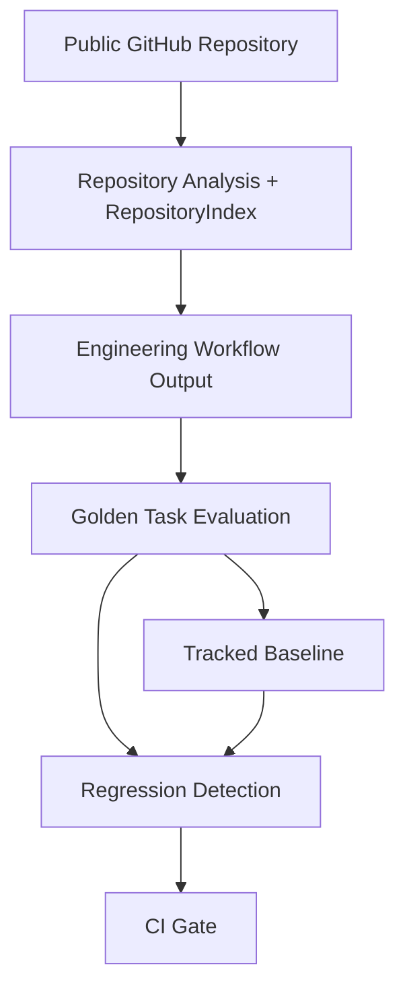
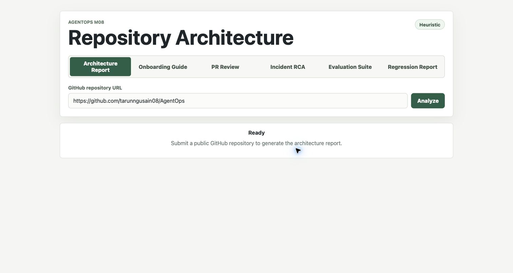
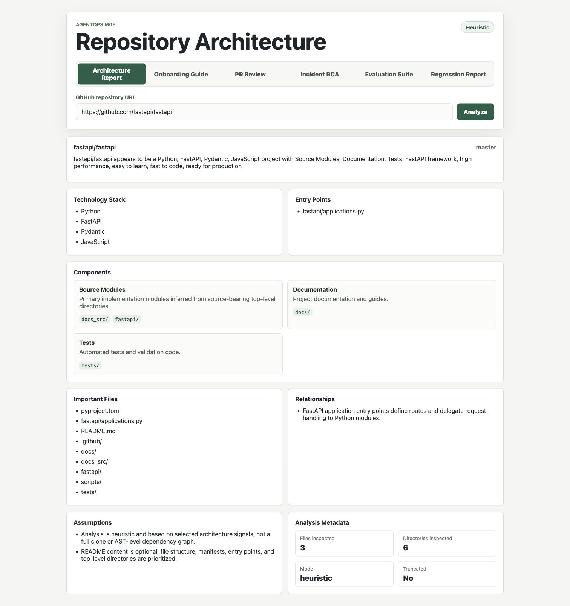
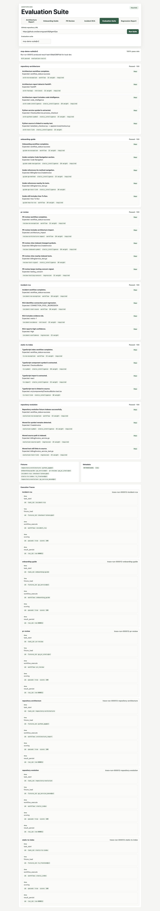
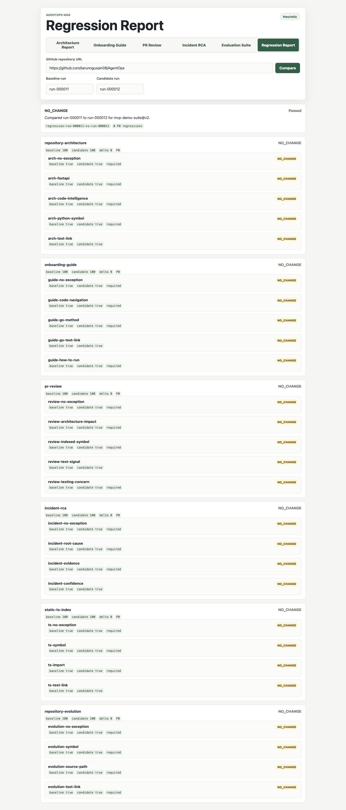
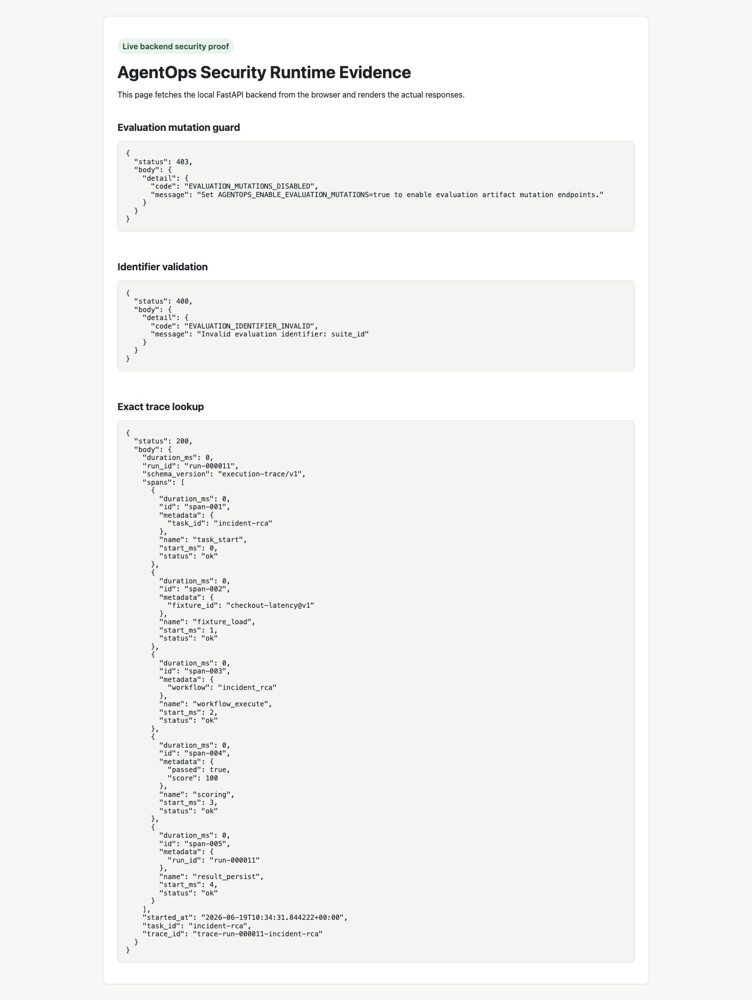

# AgentOps

AgentOps is a local-first Engineering Copilot reliability project.

It demonstrates how engineering workflows can be made reviewable and regression-tested without relying on LLM-as-judge scoring or hosted infrastructure. A user can analyze a public GitHub repository, generate onboarding documentation, review a pull request for architecture-level risk, investigate a fixture-driven incident, and then run deterministic golden-task evaluation with regression comparison and CI quality gates.

## Current Status

| Signal | Status |
| --- | --- |
| Release | `v1.0.0` |
| Product scope | Feature complete |
| Security posture | Hardened for local-first use |
| Evaluation | `mvp-demo-suite@v2` |
| Regression gate | CI enforced |
| Portfolio readiness | Ready for review |

What makes AgentOps different:

- Workflow outputs are deterministic and evidence-backed.
- Evaluation uses versioned fixtures, weighted checks, and tracked baselines.
- Regression reports and execution traces are local JSON artifacts.
- CI blocks P0 evaluation failures and P0 regressions.
- Repository intelligence is shallow, explainable, and limited to Python, TypeScript/JavaScript, and Go.

If you are reading this repo for the first time, start with the [Project Guide](docs/project-guide.md). It explains the product workflows, backend modules, frontend surface, evaluation system, security boundaries, and final v1.0.0 project status in one narrative.

## Quick Start

### Backend

```bash
cd backend
python3 -m venv .venv
source .venv/bin/activate
python -m pip install -e ".[test]"
uvicorn app.main:app --reload
```

The backend runs at `http://localhost:8000`.

### Frontend

```bash
cd frontend
npm install
npm run dev
```

The frontend runs at `http://localhost:5173`.

Use the mode selector for Architecture Report, Onboarding Guide, PR Review, Incident RCA, Evaluation Suite, and Regression Report.

### Evaluation CLI

```bash
PYTHONPATH=backend python -m app.evaluation.cli run \
  --suite mvp-demo-suite@v2 \
  --version local \
  --output .agentops/eval-runs/local.json

PYTHONPATH=backend python -m app.evaluation.cli compare \
  --baseline backend/app/evaluation/baselines/mvp-demo-suite@v2.json \
  --candidate .agentops/eval-runs/local.json \
  --fail-on-p0-regression
```

## Architecture



Diagram sources live in:

- [system-flow.mmd](docs/architecture/diagrams/system-flow.mmd)
- [evaluation-flow.mmd](docs/architecture/diagrams/evaluation-flow.mmd)

Detailed architecture docs:

- [Project Guide](docs/project-guide.md)
- [System Overview](docs/architecture/system-overview.md)
- [Design Decisions](docs/architecture/design-decisions.md)
- [Known Limitations](docs/limitations/known-limitations.md)

## Feature Timeline

| Version | Capability |
| --- | --- |
| `v0.1.0` | Repository architecture analysis |
| `v0.2.0` | Evidence-backed onboarding guide |
| `v0.3.0` | Architecture-level PR review |
| `v0.4.0` | Fixture-driven incident RCA |
| `v0.5.0` | Golden-task evaluation framework |
| `v0.6.0` | Regression reports and execution traces |
| `v0.7.0` | GitHub Actions quality gates |
| `v0.8.0` | Static repository intelligence |
| `v0.8.1` | Security hardening |
| `v1.0.0` | Readiness review, benchmark evidence, and case study |

## Product Workflows

### Architecture Report

Submit a public repository URL such as:

```text
https://github.com/fastapi/fastapi
```

Expected sections include architecture overview, technology stack, code intelligence, components, entry points, important files, relationships, assumptions, and analysis metadata.

### Onboarding Guide

Choose **Onboarding Guide** and submit a public repository URL. The guide includes project overview, technology stack, evidence-backed run guidance, architecture summary, key components, Code Navigation, common workflows, useful files, and assumptions.

Run commands are generated only from inspected evidence such as `package.json`, `pyproject.toml`, `requirements.txt`, `pom.xml`, `build.gradle`, `Dockerfile`, or `docker-compose.yml`.

### PR Review

Choose **PR Review** and submit:

```text
Repository: https://github.com/tarunngusain08/AgentOps
PR: 8
```

The review focuses on repository-structure and architecture-level impact. It does not perform code correctness verification, security auditing, vulnerability scanning, performance analysis, static analysis, style enforcement, or GitHub review comment posting.

### Incident RCA

Choose **Incident RCA** and submit:

```text
Scenario: checkout-latency
Repository: https://github.com/tarunngusain08/AgentOps
```

The repository URL is optional. The demo works without repository enrichment. The current incident workflow uses the synthetic `checkout-latency@v1` fixture and deterministic correlation rules.

## Evaluation Workflow

The default suite is `mvp-demo-suite@v2`. It contains six P0 tasks:

- `repository-architecture`
- `onboarding-guide`
- `pr-review`
- `incident-rca`
- `static-ts-index`
- `repository-evolution`

The tracked baseline lives at:

```text
backend/app/evaluation/baselines/mvp-demo-suite@v2.json
```

CI runs:

- backend tests
- frontend build
- `mvp-demo-suite@v2`
- comparison against the tracked v2 baseline

CI uploads evaluation and regression JSON artifacts with 30-day retention.

Evaluation docs:

- [Evaluation Methodology](docs/evaluation/methodology.md)
- [Benchmark Results](docs/evaluation/benchmark-results.md)

## Benchmark Summary

The v1-readiness benchmark recorded:

- Suite: `mvp-demo-suite@v2`
- Candidate run: `run-000011`
- Total tasks: `6`
- Passed tasks: `6`
- Failed tasks: `0`
- Regression status: `NO_CHANGE`
- P0 regressions: `0`

These are local AgentOps golden-task results. They are not production adoption metrics, productivity claims, or an arbitrary public benchmark.

Full evidence is in [Benchmark Results](docs/evaluation/benchmark-results.md).

## Security Posture

AgentOps is intentionally local-first and does not include users, sessions, OAuth, RBAC, billing, or tenant isolation.

Current hardening includes:

- user-submitted repositories must be public
- `GITHUB_TOKEN` is used only after an unauthenticated public metadata check
- evaluation artifact identifiers are strictly validated
- artifact paths are contained under `.agentops`
- trace lookup uses exact file matching
- HTTP evaluation mutation endpoints require `AGENTOPS_ENABLE_EVALUATION_MUTATIONS=true`

| Area | Status |
| --- | --- |
| Public Repo Enforcement | Complete |
| Identifier Validation | Complete |
| Path Containment | Complete |
| Trace Lookup Hardening | Complete |
| Evaluation Mutation Guard | Complete |

Enable HTTP evaluation mutations only for local demos:

```bash
export AGENTOPS_ENABLE_EVALUATION_MUTATIONS=true
```

CLI evaluation commands do not require this flag.

Security docs:

- [Security Review](docs/security/security-review.md)

## Repository Intelligence

`RepositoryIndex` adds shallow static intelligence for:

- Python
- TypeScript/JavaScript
- Go

It extracts selected files, symbols, imports, source-to-test links, and truncation metadata. It intentionally does not implement call graphs, type resolution, semantic analysis, Tree-sitter, embeddings, or a parser framework.

## Runtime Evidence Gallery

Screenshots captured from the local runtime are stored under `docs/images/runtime/`.

The GitHub-backed product screenshots use the public `https://github.com/fastapi/fastapi` repository. The PR review screenshot uses public PR `fastapi/fastapi#15761`.

| Demo | Screenshot |
| ---- | ---------- |
| Architecture request |  |
| Architecture report |  |
| Onboarding guide |  |
| PR review |  |
| Incident RCA |  |
| Evaluation suite traces |  |
| Regression report |  |
| Security proof |  |

## v1.0.0 Documentation Package

- [Project Guide](docs/project-guide.md)
- [Documentation Gap Analysis](docs/reviews/docs-gap-analysis.md)
- [Portfolio Packaging Review](docs/reviews/portfolio-packaging-review.md)
- [Strategic Evolution Review](docs/strategy/agentops-strategic-evolution-review.md)
- [Repository Audit](docs/reviews/repository-audit.md)
- [System Overview](docs/architecture/system-overview.md)
- [Design Decisions](docs/architecture/design-decisions.md)
- [Evaluation Methodology](docs/evaluation/methodology.md)
- [Benchmark Results](docs/evaluation/benchmark-results.md)
- [Security Review](docs/security/security-review.md)
- [Known Limitations](docs/limitations/known-limitations.md)
- [Case Study](docs/case-study/agentops-case-study.md)
- [Readiness Review](docs/release/v1-readiness-review.md)

## Roadmap Status

AgentOps is feature-complete as a portfolio project at v1.0.0. Future work should focus on case-study presentation, benchmark explanation, demo polish, and interview discussion rather than adding new platform features.

Explicit non-goals remain:

- hosted SaaS
- database persistence
- vector search
- GraphRAG
- multi-agent orchestration
- authentication or RBAC
- Tree-sitter or parser-framework integration
- production telemetry ingestion
