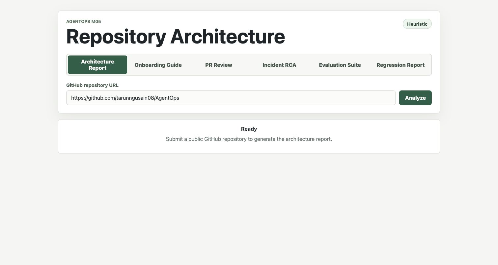
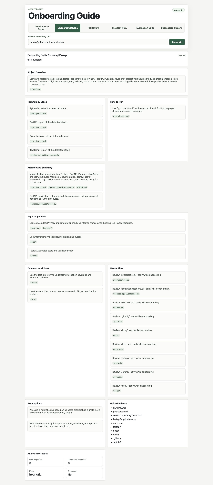
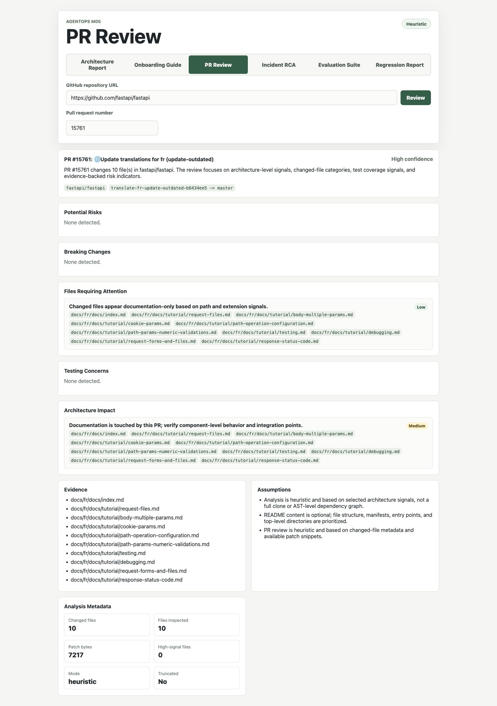
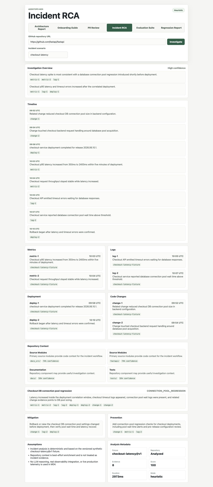
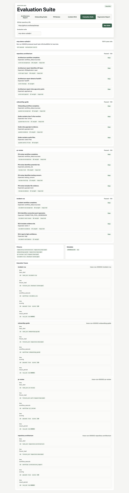
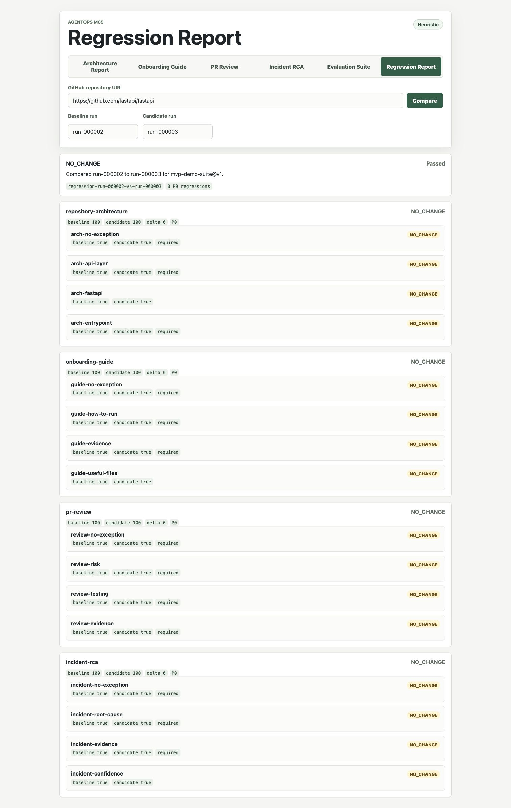

# AgentOps

AgentOps is a Production Engineering Copilot with Built-In Agent Reliability.

The current product surface is intentionally small and demo-first: a user submits a public GitHub repository URL, then chooses an architecture report, a new-engineer onboarding guide, an evidence-backed pull request review, or a fixture-driven incident RCA generated from deterministic analysis. AgentOps also includes deterministic static code intelligence, golden-task evaluation, regression comparison, execution traces, and CI quality gates.

## M01: Repository Understanding

The current milestone supports:

- Public GitHub repository URL parsing.
- Read-only GitHub metadata and file loading.
- Lightweight file selection with hard limits.
- Deterministic language, framework, module, entry-point, and component detection.
- A source-grounded architecture report that works without a model API key.
- A minimal React UI for Demo #1.

M01 intentionally does not include a database, vector search, RAG, tracing, evaluation, PR review, incident investigation, or multi-agent orchestration.

## M02: Documentation Assistant

M02 adds the second demo capability: a user submits a public GitHub repository URL and receives a source-grounded onboarding guide for new engineers.

The onboarding guide includes:

- Project overview.
- Technology stack.
- Evidence-backed how-to-run guidance.
- Architecture summary.
- Key components.
- Common workflows.
- Useful files.
- Assumptions.

How-to-run guidance is generated only from inspected evidence such as `package.json`, `pyproject.toml`, `requirements.txt`, `pom.xml`, `build.gradle`, `Dockerfile`, or `docker-compose.yml`. If no inspected file supports a run instruction, AgentOps states that assumption instead of inventing a command.

## M03: PR Review

M03 adds the third demo capability: a user submits a public GitHub repository URL and pull request number, then receives a deterministic review report focused on repository-structure and architecture-level impact.

The PR review includes:

- Summary.
- Potential risks.
- Breaking changes.
- Files requiring attention.
- Testing concerns.
- Architecture impact.
- Evidence.
- Assumptions.
- Confidence.

PR review is heuristic and evidence-backed. It does not perform code correctness verification, security auditing, vulnerability scanning, performance analysis, static analysis, style enforcement, language-specific linting, or GitHub review comments.

## M04: Incident Investigation

M04 adds the fourth demo capability: a user chooses the `checkout-latency` incident scenario and optionally provides a public GitHub repository URL, then receives an evidence-backed RCA.

The incident RCA includes:

- Investigation overview.
- Timeline.
- Evidence grouped by metrics, logs, deployments, and code changes.
- Optional repository context.
- Suspected root cause.
- Mitigation.
- Prevention.
- Assumptions.
- Analysis metadata.

M04 is intentionally fixture-driven. It uses the synthetic `checkout-latency@v1` scenario, deterministic correlation rules, and heuristic classification. It does not use real observability integrations, LLM reasoning, tracing, RAG, embeddings, or incident-provider plugins.

## M05: Evaluation Framework

M05 adds deterministic golden-task evaluation for the four demo workflows already in the product:

- Repository architecture report.
- Onboarding guide.
- Pull request review.
- Incident RCA.

The original built-in suite is `mvp-demo-suite@v1`. It runs pinned fixtures through the existing workflow code, scores weighted checks, records required-check failures, and persists a local evaluation run under `.agentops/eval-runs/`.

Evaluation is intentionally fixture-backed and explainable. It does not use LLM judgment, external services, a database, RAG, embeddings, tracing, or CI gates yet.

## M06: Regression Reports And Execution Traces

M06 adds local regression comparison and execution trace inspection.

Regression comparison reads two persisted evaluation runs from `.agentops/eval-runs/`, verifies that their suite id, suite version, task ids, and check ids match, then writes a regression report under `.agentops/regression-reports/`.

Execution traces are separate local artifacts written under `.agentops/traces/`. They provide a flat timeline for each evaluated task:

- `task_start`
- `fixture_load`
- `workflow_execute`
- `scoring`
- `result_persist`

Regression comparison does not require trace files. If traces are missing, comparison still works from evaluation run JSON alone.

## M07: GitHub Quality Gates

M07 adds CI quality gates around the deterministic evaluation framework.

The tracked baseline lives at:

```text
backend/app/evaluation/baselines/mvp-demo-suite@v2.json
```

The baseline is validated before comparison:

- `result_hash` must match the canonical evaluation result content.
- Suite id/version must match `mvp-demo-suite@v2`.
- The P0 task list must match the suite definition.

Local CLI commands:

```bash
PYTHONPATH=backend python -m app.evaluation.cli run \
  --suite mvp-demo-suite@v2 \
  --version local \
  --output .agentops/eval-runs/local.json

PYTHONPATH=backend python -m app.evaluation.cli compare \
  --baseline backend/app/evaluation/baselines/mvp-demo-suite@v2.json \
  --candidate .agentops/eval-runs/local.json \
  --fail-on-p0-regression
```

Baseline refreshes should be isolated:

1. Run the suite locally.
2. Review changed task/check output.
3. Replace the baseline file.
4. Open a dedicated baseline-refresh PR.
5. Do not include implementation changes in the same PR.
6. Explain why the baseline changed in the PR description.

CI fails when backend tests fail, the frontend build fails, baseline integrity is invalid, a candidate P0 task fails, or a P0 regression is detected. CI uploads evaluation and regression JSON artifacts with 30-day retention.

## M08: Static Code Intelligence

M08 adds deterministic shallow static code intelligence for Python, TypeScript/JavaScript, and Go through a reusable `RepositoryIndex`.

The index captures:

- Source files with language, role, and directory group.
- Shallow symbols such as Python classes/functions, TypeScript exports, and Go packages/types/functions/methods.
- Imports.
- Source-to-test links from deterministic path and stem matching.
- Metadata for indexed files, symbols, imports, tests, truncation, and truncation reason.

Existing workflows are enriched instead of adding a new mode:

- Architecture reports include a `code_intelligence` section.
- Onboarding guides include `Code Navigation`.
- PR review findings can reference indexed symbols, imports, and nearby tests.
- Incident RCA can use repository index signals as contextual enrichment.

M08 intentionally does not add a call graph, type resolution, tree-sitter, semantic analysis, embeddings, LLM judging, a database, or multi-agent orchestration.

The default evaluation suite is now `mvp-demo-suite@v2`. Version `v1` remains readable and comparable for older runs.

The tracked v2 baseline lives at:

```text
backend/app/evaluation/baselines/mvp-demo-suite@v2.json
```

Local CLI commands:

```bash
PYTHONPATH=backend python -m app.evaluation.cli run \
  --suite mvp-demo-suite@v2 \
  --version local \
  --output .agentops/eval-runs/local.json

PYTHONPATH=backend python -m app.evaluation.cli compare \
  --baseline backend/app/evaluation/baselines/mvp-demo-suite@v2.json \
  --candidate .agentops/eval-runs/local.json \
  --fail-on-p0-regression
```

## Local Setup

### Backend

```bash
cd backend
python3 -m venv .venv
source .venv/bin/activate
python -m pip install -e ".[test]"
uvicorn app.main:app --reload
```

The backend runs at `http://localhost:8000`.

Useful endpoints:

- `GET /health`
- `POST /api/v1/repositories/analyze`
- `POST /api/v1/repositories/guides/onboarding`
- `POST /api/v1/repositories/pull-requests/review`
- `POST /api/v1/incidents/investigate`
- `GET /api/v1/evaluations/suites`
- `POST /api/v1/evaluations/run`
- `GET /api/v1/evaluations/runs/{run_id}`
- `POST /api/v1/evaluations/compare`
- `GET /api/v1/evaluations/runs/{run_id}/traces`
- `GET /api/v1/evaluations/traces/{trace_id}`

Optional environment variable:

```bash
export GITHUB_TOKEN=...
```

AgentOps only supports user-submitted public GitHub repositories. When `GITHUB_TOKEN` is configured, the backend first verifies the repository is public without the token, then uses the token only as a rate-limit helper for public GitHub API calls.

Evaluation artifact mutation endpoints are disabled by default. Enable them only for local HTTP demos:

```bash
export AGENTOPS_ENABLE_EVALUATION_MUTATIONS=true
```

This enables `POST /api/v1/evaluations/run` and `POST /api/v1/evaluations/compare`. The CLI evaluation commands do not require this flag.

AgentOps intentionally does not include authentication, user accounts, RBAC, OAuth, sessions, or multi-tenant controls.

### Frontend

```bash
cd frontend
npm install
npm run dev
```

The frontend runs at `http://localhost:5173` and calls the backend at `http://localhost:8000` by default. Use the mode selector to switch between Architecture Report, Onboarding Guide, PR Review, Incident RCA, Evaluation Suite, and Regression Report.

To point it at a different backend:

```bash
VITE_API_BASE_URL=http://localhost:8000 npm run dev
```

## Demo #1

Start the backend and frontend, then submit a public repository URL such as:

```text
https://github.com/fastapi/fastapi
```

Expected report sections:

- Architecture overview.
- Technology stack.
- Code intelligence.
- Components.
- Entry points.
- Important files.
- High-level relationships.
- Assumptions.
- Analysis metadata.

## Demo #2

Start the backend and frontend, choose **Onboarding Guide**, then submit a public repository URL such as:

```text
https://github.com/fastapi/fastapi
```

Expected guide sections:

- Project Overview.
- Technology Stack.
- How To Run.
- Architecture Summary.
- Key Components.
- Code Navigation.
- Common Workflows.
- Useful Files.
- Assumptions.
- Analysis metadata.

## Demo #3

Start the backend and frontend, choose **PR Review**, then submit:

```text
Repository: https://github.com/tarunngusain08/AgentOps
PR: 8
```

Expected review sections:

- Summary.
- Potential Risks.
- Breaking Changes.
- Files Requiring Attention.
- Testing Concerns.
- Architecture Impact.
- Evidence.
- Assumptions.
- Confidence.
- Analysis metadata.

## Demo #4

Start the backend and frontend, choose **Incident RCA**, then submit:

```text
Scenario: checkout-latency
Repository: https://github.com/tarunngusain08/AgentOps
```

The repository URL is optional. The demo still works without repository enrichment.

Expected RCA sections:

- Investigation Overview.
- Timeline.
- Evidence.
- Repository Context.
- Root Cause.
- Mitigation.
- Prevention.
- Assumptions.
- Analysis metadata.

## Demo #5

Start the backend and frontend, choose **Evaluation Suite**, then submit:

```text
Suite: mvp-demo-suite@v2
```

Older M05-M07 runs can still use:

```text
Suite: mvp-demo-suite@v1
```

Expected evaluation sections:

- Suite summary.
- Run ID.
- Result hash.
- Per-task pass/fail status.
- Weighted check results.
- Fixture versions.
- Analysis metadata.

The run is persisted locally under:

```text
.agentops/eval-runs/mvp-demo-suite@v2/
```

Older v1 runs are stored under:

```text
.agentops/eval-runs/mvp-demo-suite@v1/
```

## Demo #6

Start the backend and frontend, choose **Evaluation Suite**, and run `mvp-demo-suite@v2` twice. This creates two local run IDs such as:

```text
run-000001
run-000002
```

Then choose **Regression Report** and submit:

```text
Baseline: run-000001
Candidate: run-000002
```

Expected regression sections:

- Overall status.
- Comparison pass/fail.
- Per-task score deltas.
- Required-check changes.
- Regression reasons.
- P0 regression count.

Expected trace sections under the Evaluation Suite result:

- One trace per evaluated task.
- Flat ordered spans.
- Primitive diagnostic metadata.

## Runtime Demo Screenshots

Screenshots captured from the local runtime are stored under `testing/screenshots/runtime/demo/`.

The GitHub-backed screenshots use the public `https://github.com/fastapi/fastapi` repository so the demo can run without private repository credentials. The PR review screenshot uses public PR `fastapi/fastapi#15761`.

| Demo | Screenshot |
| ---- | ---------- |
| Home / ready state |  |
| Architecture report |  |
| Onboarding guide |  |
| PR review |  |
| Incident RCA |  |
| Evaluation suite traces |  |
| Regression report |  |

## Current Limits

Repository analysis is intentionally lightweight:

- Maximum 100 files inspected.
- Maximum 2 MB fetched file content.
- README is optional and not trusted as the primary signal.
- Repositories are not cloned locally.
- Analysis favors file structure, manifests, entry points, and directory hierarchy.
- Static code intelligence is shallow and deterministic for Python, TypeScript/JavaScript, and Go.
- Static code intelligence does not expose raw line numbers prominently in public reports.
- Repository index truncation is reported with `file_limit`, `byte_limit`, `unsupported_language`, or `none`.
- Onboarding guides use heuristic generation and do not require a model API key.
- PR review is limited to changed-file metadata, available patch snippets, and repository architecture signals.
- PR review inspects at most 200 changed files and 1 MB of patch content.
- Incident investigation currently supports only the synthetic `checkout-latency@v1` fixture.
- Incident investigation is deterministic and evidence-backed, not a real production telemetry integration.
- Evaluation defaults to `mvp-demo-suite@v2`; `mvp-demo-suite@v1` remains readable for older runs.
- Evaluation run IDs are local to `.agentops/`; deleting that directory may reset counters.
- Evaluation assumes single-process local execution and does not support concurrent run generation.
- Regression comparison currently supports same-suite, same-version evaluation runs only.
- Execution traces are local JSON timelines, not real OpenTelemetry provider integrations.
- Trace span metadata is intentionally small and must not contain large workflow outputs.
- GitHub quality gates do not post PR comments yet.
- Baseline refresh PRs must be separate from implementation PRs.
- The system does not persist repositories, create embeddings, or perform full dependency/call-graph analysis.
