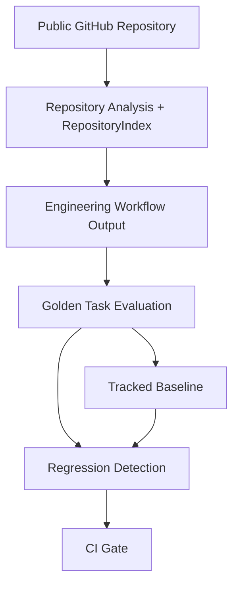

# AgentOps System Overview

AgentOps is a local-first Engineering Copilot evaluation platform. It provides four deterministic engineering workflows and then evaluates those workflows with fixture-backed golden tasks, regression comparison, execution traces, and CI quality gates.

The system is intentionally built as a modular monolith. The project goal is to demonstrate a trustworthy Engineering Copilot and its reliability layer, not to demonstrate distributed infrastructure. That means the source code favors direct service classes, dataclasses, Pydantic response models, local JSON artifacts, and deterministic fixtures over queues, databases, service meshes, or plugin frameworks.

## System Goals

- Deterministic evaluation: `backend/app/evaluation/suites.py` defines versioned suites and weighted checks.
- Explainable outputs: workflow outputs include source paths, evidence ids, fixture versions, or repository context depending on workflow.
- Local-first execution: evaluation artifacts are written under `.agentops/`, which is ignored by `.gitignore`.
- No LLM judging: scoring uses `backend/app/evaluation/matcher.py`, `runner.py`, and `regression.py`.
- Reproducibility: persisted runs use canonical JSON and result hashes through `backend/app/evaluation/json_utils.py` and `hashing.py`.

## Core Components

### Repository Analysis

`GitHubService` loads public GitHub metadata, trees, and selected files. The service verifies public repository metadata without `GITHUB_TOKEN` before token-backed content fetches.

`RepositoryAnalyzer` turns a repository snapshot into deterministic architecture signals: technology stack, components, entry points, relationships, assumptions, and repository index context.

The file-selection layer keeps repository analysis lightweight. It prioritizes manifests, framework configuration, infrastructure files, entry-point-like files, selected source files, and top-level structure. The repository is not cloned locally.

### Repository Intelligence

`RepositoryIndex` is built by `backend/app/analyzer/repository_index.py`. It captures indexed files, shallow symbols, imports, source-to-test links, and truncation metadata for Python, TypeScript/JavaScript, and Go.

The index intentionally avoids call graphs, type resolution, semantic analysis, Tree-sitter, embeddings, and LLM reasoning.

The index is consumed by architecture reports, onboarding guides, PR review enrichment, and best-effort incident repository context. It is not exposed as a separate product mode because the goal is to make existing workflows more useful rather than add another workflow surface.

### Workflow Generation

The product workflows are exposed through `backend/app/api/routes.py`:

- `POST /api/v1/repositories/analyze`
- `POST /api/v1/repositories/guides/onboarding`
- `POST /api/v1/repositories/pull-requests/review`
- `POST /api/v1/incidents/investigate`

The frontend in `frontend/src/App.tsx` exposes the same modes in a single UI.

The frontend also exposes the local evaluation and regression flows. Those modes are useful for demos because they show that AgentOps can validate its own outputs, not just generate them.

### Evaluation Framework

`mvp-demo-suite@v2` contains six P0 tasks:

- `repository-architecture`
- `onboarding-guide`
- `pr-review`
- `incident-rca`
- `static-ts-index`
- `repository-evolution`

Each task has weighted checks. A task passes only when the score meets the threshold and every required check passes.

The v1 suite is retained for older artifacts. The v2 suite is the default because it includes static-intelligence and repository-evolution coverage.

### Regression Reporting

`backend/app/evaluation/regression.py` compares same-suite, same-version evaluation runs. The comparator reports score deltas, required-check changes, P0 regressions, and overall status.

### Execution Traces

`backend/app/evaluation/tracing.py` creates flat execution traces. Allowed span names are validated before traces are persisted.

### Quality Gates

`.github/workflows/agentops-quality.yml` runs backend tests, frontend build, `mvp-demo-suite@v2`, and baseline comparison on pull requests and pushes to `main`.

This turns the evaluation framework into a quality gate. A pull request can fail for ordinary test/build failures, candidate P0 task failures, or P0 regressions against the tracked baseline.

## API Surface

| Endpoint | Purpose |
| --- | --- |
| `GET /health` | health check |
| `POST /api/v1/repositories/analyze` | architecture report |
| `POST /api/v1/repositories/guides/onboarding` | onboarding guide |
| `POST /api/v1/repositories/pull-requests/review` | PR review |
| `POST /api/v1/incidents/investigate` | incident RCA |
| `GET /api/v1/evaluations/suites` | list evaluation suites |
| `POST /api/v1/evaluations/run` | create evaluation run through HTTP, disabled unless explicitly enabled |
| `GET /api/v1/evaluations/runs/{run_id}` | load a persisted run |
| `POST /api/v1/evaluations/compare` | create regression report through HTTP, disabled unless explicitly enabled |
| `GET /api/v1/evaluations/runs/{run_id}/traces` | list traces for a run |
| `GET /api/v1/evaluations/traces/{trace_id}` | load one trace |

Evaluation mutation endpoints are intentionally disabled by default for HTTP use. The CLI quality gate remains the primary evaluation path.

## Data Flow

The Mermaid source is also stored in `docs/architecture/diagrams/system-flow.mmd` and `docs/architecture/diagrams/evaluation-flow.mmd`.

## Non-Goals

AgentOps is not:

- an autonomous coding agent
- GraphRAG
- a hosted platform
- multi-agent orchestration
- production SaaS infrastructure
- an authentication or RBAC system
- a general static-analysis platform
- a vector database or embedding pipeline
