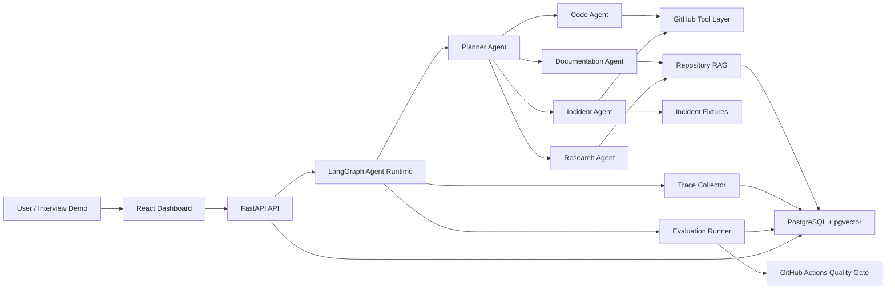

# AgentOps Implementation Plan

AgentOps is a **Production Engineering Copilot with Built-In Agent Reliability**.

Do not optimize for architectural completeness. Optimize for a portfolio-quality project that can be completed and demonstrated by a solo engineer within 4-6 weeks.

## 1. Portfolio Positioning

AgentOps is not a generic AI chatbot and it is not only an evaluation platform. It is an Engineering Copilot that helps developers understand repositories, review changes, generate onboarding documentation, investigate incidents, and verify agent behavior through built-in reliability workflows.

The project should demonstrate:

- Multi-agent orchestration through LangGraph.
- Tool calling through GitHub-focused repository and PR operations.
- RAG over repository documentation and selected source files.
- Planning with clear task decomposition.
- Lightweight memory for prior repository analysis and workflow history.
- Golden-task evaluation and regression comparison.
- OpenTelemetry-based tracing for agent runs, tool calls, cost, and latency.
- GitHub Actions integration for AI quality gates.

The intended audience is senior/staff-adjacent backend, AI platform, developer productivity, and infrastructure interviewers. A recruiter or hiring manager should understand the project within 30 seconds:

```text
User asks an engineering question
Planner creates an investigation workflow
Specialized agents inspect GitHub data and repository context
Copilot produces an engineering answer
Evaluation and tracing validate reliability
CI reports regressions before changes ship
```

## 2. Project Success Definition

A successful outcome is:

- A working Engineering Copilot demo.
- All six demo scenarios functioning end-to-end.
- Clear architecture documentation.
- Strong resume bullets.
- Strong system design interview discussion material.

An unsuccessful outcome is:

- Excessive abstraction.
- Enterprise-grade architecture without working demos.
- Generic platform infrastructure that delays user-facing capabilities.
- Documentation that cannot realistically be executed by a solo engineer within 4-6 weeks.

Tradeoff rule:

- Working demo > architectural purity.
- Simplicity > extensibility.
- Execution speed > completeness.
- Portfolio value > enterprise readiness.

Every milestone must end with something demoable to an interviewer within 5 minutes.

## 3. Product Layer

### 3.1 Workflow 1: Code Understanding

Goal: answer "Explain this repository" with a credible architecture overview.

Core behavior:

- Fetch repository metadata, README, file tree, and selected source files.
- Detect likely components, framework choices, entry points, and data flow.
- Produce a concise architecture summary with component relationships.
- Link claims to source files or repository documents.

Demo prompt:

```text
Explain the architecture of this repository and identify the main components.
```

MVP output:

- Architecture overview.
- Component list.
- Data/control flow summary.
- Important files.
- Risks or unknowns.

### 3.2 Workflow 2: PR Review

Goal: answer "Review this PR" with specific risks, affected areas, and actionable feedback.

Core behavior:

- Fetch PR metadata, changed files, patch summaries, and referenced issues.
- Classify changes by risk: behavior, data, security, reliability, performance, tests.
- Use repository context to understand affected components.
- Produce review findings with severity, rationale, and suggested fixes.

Demo prompt:

```text
Review PR #145 and identify correctness, reliability, and test risks.
```

MVP output:

- Summary of change.
- Risk findings.
- Missing test suggestions.
- Questions for the author.
- Overall merge recommendation.

### 3.3 Workflow 3: Documentation Assistant

Goal: generate onboarding documentation from code and repository context.

Core behavior:

- Search README, docs, configuration, and key source files.
- Infer service purpose, local setup, APIs, dependencies, and operational notes.
- Generate developer-facing onboarding documentation.
- Include source attribution and uncertainty markers.

Demo prompt:

```text
Generate onboarding documentation for this service.
```

MVP output:

- Service purpose.
- Architecture summary.
- Setup steps.
- Main workflows.
- Important files.
- Common troubleshooting notes.

### 3.4 Workflow 4: Incident Investigation

Goal: investigate a production-like issue and generate an RCA.

Core behavior:

- Accept an incident prompt, such as checkout latency spike.
- Build an investigation plan.
- Inspect recent commits or PRs.
- Search code for affected paths and likely bottlenecks.
- Read provided sample logs or synthetic incident fixtures.
- Generate root cause, evidence, impact, mitigation, and follow-up actions.

Demo prompt:

```text
Investigate why checkout latency increased after yesterday's deployment.
```

MVP output:

- Investigation plan.
- Evidence reviewed.
- Suspected root cause.
- Confidence level.
- Immediate mitigation.
- Long-term prevention.

MVP fixture:

- A seeded sample repository or sample incident package that includes a checkout latency log, a deployment event, and a PR/code change that introduces a connection pool regression.

### 3.5 Workflow 5: Evaluation Suite

Goal: run repeatable golden tasks against the copilot and score behavior.

Core behavior:

- Define golden tasks for the six demo scenarios.
- Run the agent against a fixed repository or fixture.
- Score task success, required facts, tool usage, retrieval quality, and output quality.
- Store run results.

Demo prompt:

```text
Run the evaluation suite for the current agent version.
```

MVP output:

- Pass/fail summary.
- Per-task score.
- Required facts found/missing.
- Tool-use correctness.
- Cost and latency summary.

### 3.6 Workflow 6: Regression Report

Goal: compare two evaluation runs and identify regressions.

Core behavior:

- Load two eval run results.
- Compare pass rate, task scores, latency, cost, and policy violations.
- Flag regressions against thresholds.
- Produce a concise report suitable for PR comments.

Demo prompt:

```text
Compare version A vs version B and identify regressions.
```

MVP output:

- Overall regression status.
- Changed pass rate.
- Regressed tasks.
- Cost/latency changes.
- Suggested next actions.

## 4. Six MVP Demo Scenarios

The MVP is complete only when all six scenarios work end-to-end:

| Scenario | User prompt | End-to-end success |
| --- | --- | --- |
| 1. Explain repository architecture | "Explain this repository." | Architecture overview is grounded in repository files. |
| 2. Review a pull request | "Review PR #145." | PR risks, missing tests, and merge recommendation are generated. |
| 3. Generate onboarding documentation | "Generate onboarding docs for this service." | Developer onboarding doc is produced with source references. |
| 4. Investigate incident and RCA | "Investigate checkout latency spike." | Agent follows an investigation path and produces evidence-backed RCA. |
| 5. Execute evaluation suite | "Run eval suite." | Golden tasks run with scores, traces, and pass/fail status. |
| 6. Compare versions and detect regressions | "Compare eval runs A and B." | Regression report identifies degraded tasks or metrics. |

No additional feature should delay MVP completion.

## 5. System Architecture

Use a modular monolith. Keep modules independently testable, but deploy them as one backend service for the MVP.



MVP deployment:

- One FastAPI backend.
- One React frontend.
- One PostgreSQL database with pgvector.
- Optional Docker Compose for local development.
- GitHub Actions for tests and evaluation.

## 6. Service Boundaries

These are module boundaries, not microservices.

| Module | Responsibility | MVP notes |
| --- | --- | --- |
| API module | HTTP endpoints, request validation, auth placeholder, response models | Keep auth simple or disabled for local demo. |
| Agent runtime module | LangGraph workflows, planner, agent routing, state transitions | Central product surface. |
| Tool module | GitHub repository, PR, commit, and file operations | GitHub-only in MVP. |
| RAG module | Repository ingestion, chunking, embeddings, retrieval, source attribution | Repository docs and selected source files only. |
| Evaluation module | Golden tasks, scoring, regression comparison | Deterministic checks first. |
| Trace module | Run events, tool calls, model calls, cost, latency, OpenTelemetry spans | Basic trace explorer data. |
| Dashboard module | Demo UI for running workflows and viewing results | Minimal, not enterprise analytics. |
| Persistence module | SQLAlchemy models, migrations, repositories | PostgreSQL + pgvector. |

Avoid creating separate services, event buses, plugin systems, or generic workflow engines in MVP.

## 7. Domain Model

Core entities:

- `Repository`: GitHub repository metadata and indexing status.
- `RepositoryFile`: selected files fetched from GitHub.
- `DocumentChunk`: indexed repository text with embedding and source metadata.
- `Conversation`: user interaction thread.
- `AgentRun`: one user request executed by the copilot.
- `TaskStep`: planner-created work item assigned to an agent.
- `ToolInvocation`: one GitHub, retrieval, or fixture tool call.
- `TraceEvent`: time-ordered runtime event.
- `MemoryItem`: lightweight reusable fact about a repo, user preference, or prior run.
- `GoldenTask`: repeatable evaluation prompt and expected checks.
- `EvalSuite`: group of golden tasks.
- `EvalRun`: execution of an eval suite against one agent version.
- `EvalResult`: score details for one golden task execution.
- `PolicyRule`: simple guardrail configuration.
- `PolicyViolation`: recorded policy breach.

Relationships:

- Repository has many RepositoryFiles and DocumentChunks.
- Conversation has many AgentRuns.
- AgentRun has many TaskSteps, ToolInvocations, TraceEvents, and optional EvalResults.
- EvalSuite has many GoldenTasks.
- EvalRun has many EvalResults.

## 8. Database Schema

PostgreSQL tables for MVP:

```sql
repositories (
  id uuid primary key,
  owner text not null,
  name text not null,
  default_branch text,
  github_url text not null,
  indexed_at timestamptz,
  created_at timestamptz not null
);

repository_files (
  id uuid primary key,
  repository_id uuid not null references repositories(id),
  path text not null,
  sha text,
  language text,
  content text,
  fetched_at timestamptz not null
);

document_chunks (
  id uuid primary key,
  repository_id uuid not null references repositories(id),
  source_type text not null,
  source_path text not null,
  chunk_index integer not null,
  content text not null,
  embedding vector(1536),
  metadata jsonb not null default '{}',
  created_at timestamptz not null
);

conversations (
  id uuid primary key,
  title text,
  created_at timestamptz not null
);

agent_runs (
  id uuid primary key,
  conversation_id uuid references conversations(id),
  repository_id uuid references repositories(id),
  user_prompt text not null,
  workflow_type text not null,
  status text not null,
  final_answer text,
  model_name text,
  total_cost_usd numeric,
  total_latency_ms integer,
  created_at timestamptz not null,
  completed_at timestamptz
);

task_steps (
  id uuid primary key,
  agent_run_id uuid not null references agent_runs(id),
  agent_name text not null,
  step_order integer not null,
  instruction text not null,
  status text not null,
  output text,
  created_at timestamptz not null,
  completed_at timestamptz
);

tool_invocations (
  id uuid primary key,
  agent_run_id uuid not null references agent_runs(id),
  task_step_id uuid references task_steps(id),
  tool_name text not null,
  input jsonb not null,
  output_summary text,
  status text not null,
  latency_ms integer,
  created_at timestamptz not null
);

trace_events (
  id uuid primary key,
  agent_run_id uuid not null references agent_runs(id),
  event_type text not null,
  actor text,
  payload jsonb not null,
  latency_ms integer,
  created_at timestamptz not null
);

memory_items (
  id uuid primary key,
  repository_id uuid references repositories(id),
  memory_type text not null,
  content text not null,
  metadata jsonb not null default '{}',
  created_at timestamptz not null
);

eval_suites (
  id uuid primary key,
  name text not null,
  description text,
  created_at timestamptz not null
);

golden_tasks (
  id uuid primary key,
  eval_suite_id uuid not null references eval_suites(id),
  name text not null,
  workflow_type text not null,
  prompt text not null,
  required_facts jsonb not null default '[]',
  expected_tools jsonb not null default '[]',
  scoring_config jsonb not null default '{}',
  created_at timestamptz not null
);

eval_runs (
  id uuid primary key,
  eval_suite_id uuid not null references eval_suites(id),
  version_label text not null,
  status text not null,
  pass_rate numeric,
  created_at timestamptz not null,
  completed_at timestamptz
);

eval_results (
  id uuid primary key,
  eval_run_id uuid not null references eval_runs(id),
  golden_task_id uuid not null references golden_tasks(id),
  agent_run_id uuid references agent_runs(id),
  score numeric not null,
  passed boolean not null,
  details jsonb not null,
  created_at timestamptz not null
);

policy_rules (
  id uuid primary key,
  name text not null,
  rule_type text not null,
  config jsonb not null,
  enabled boolean not null default true,
  created_at timestamptz not null
);

policy_violations (
  id uuid primary key,
  agent_run_id uuid references agent_runs(id),
  policy_rule_id uuid references policy_rules(id),
  severity text not null,
  message text not null,
  created_at timestamptz not null
);
```

Indexes:

- `repositories(owner, name)` unique.
- `repository_files(repository_id, path)`.
- `document_chunks(repository_id, source_path)`.
- pgvector index on `document_chunks.embedding`.
- `agent_runs(repository_id, workflow_type, created_at)`.
- `trace_events(agent_run_id, created_at)`.
- `tool_invocations(agent_run_id, created_at)`.
- `eval_results(eval_run_id, golden_task_id)`.

This schema is intentionally lean. Do not add workspace, organization, billing, RBAC, tenant, audit-retention, or plugin tables in MVP.

## 9. API Design

Base prefix: `/api/v1`.

Repository and RAG:

- `POST /repositories`: register a GitHub repository.
- `POST /repositories/{repository_id}/index`: fetch selected files and build chunks.
- `GET /repositories/{repository_id}`: repository details and indexing status.
- `POST /repositories/{repository_id}/search`: semantic search with source results.

Copilot workflows:

- `POST /runs`: create an agent run.
- `GET /runs/{run_id}`: run status and final answer.
- `GET /runs/{run_id}/events`: trace events for UI rendering.
- `GET /runs/{run_id}/tools`: tool invocation summary.
- `GET /runs/{run_id}/stream`: server-sent events for live progress.

PR review:

- `POST /repositories/{repository_id}/pull-requests/{number}/review`: start PR review workflow.

Evaluation:

- `GET /eval/suites`: list suites.
- `POST /eval/suites`: create or update golden suite.
- `POST /eval/suites/{suite_id}/runs`: run suite for a version label.
- `GET /eval/runs/{eval_run_id}`: eval run summary.
- `POST /eval/compare`: compare two eval runs and return regression report.

Dashboard:

- `GET /dashboard/summary`: recent runs, pass rates, cost, latency.
- `GET /dashboard/regressions`: recent regression reports.

Request example:

```json
{
  "repository_id": "uuid",
  "workflow_type": "architecture_explorer",
  "prompt": "Explain this repository architecture."
}
```

Response example:

```json
{
  "run_id": "uuid",
  "status": "running",
  "stream_url": "/api/v1/runs/uuid/stream"
}
```

## 10. Agent Design

Use LangGraph for explicit state, branching, and traceable execution.

### 10.1 Shared Agent State

```text
AgentState:
  user_prompt
  repository_context
  workflow_type
  plan
  task_steps
  retrieved_context
  tool_results
  intermediate_findings
  final_answer
  trace_context
  policy_status
```

### 10.2 Planner Agent

Responsibilities:

- Classify workflow type.
- Produce 3-7 investigation steps.
- Assign steps to specialized agents.
- Decide whether retrieval, GitHub tools, or incident fixtures are needed.
- Summarize reasoning in a user-safe way.

### 10.3 Code Agent

Responsibilities:

- Inspect repository tree and files.
- Identify components, dependencies, entry points, and risky code paths.
- Support architecture explanation and PR review.

Tools:

- `github.get_repo_tree`
- `github.get_file`
- `github.search_code`
- `github.get_commit`
- `rag.search_repository`

### 10.4 Documentation Agent

Responsibilities:

- Retrieve README/docs/config context.
- Generate onboarding documentation.
- Provide source-attributed explanations.

Tools:

- `rag.search_repository`
- `github.get_file`
- `memory.get_repository_facts`
- `memory.save_repository_fact`

### 10.5 Incident Agent

Responsibilities:

- Execute incident investigation plans.
- Correlate symptoms with recent changes.
- Search code paths and fixture logs.
- Produce RCA format.

Tools:

- `github.list_recent_commits`
- `github.get_pull_request`
- `github.search_code`
- `incident.read_fixture_log`
- `rag.search_repository`

### 10.6 Research Agent

Responsibilities:

- Fill gaps with technical comparisons or best practices.
- Support ADR-like explanations.

MVP note: keep external web research optional. The core demo should work from repository and fixture data.

### 10.7 Final Synthesizer

Responsibilities:

- Combine agent findings.
- Preserve evidence and source references.
- Produce concise engineering output.
- Flag uncertainty.

## 11. Tool Layer

MVP is GitHub-only.

GitHub tools:

- Get repository metadata.
- List repository tree.
- Fetch file content.
- Search code.
- Get pull request metadata.
- Get pull request changed files and patches.
- List recent commits.
- Get commit details.

RAG tools:

- Search indexed repository docs/source.
- Retrieve source snippets.
- Return source references.

Incident fixture tools:

- Read sample logs.
- Read sample metrics.
- Read sample deployment event.

Policy controls:

- Maximum tool calls per run.
- Read-only GitHub operations.
- Maximum run duration.
- Sensitive token redaction in traces.

Do not implement Jira, Confluence, databases, Slack, PagerDuty, plugin tools, or write-capable tools in MVP.

## 12. RAG Architecture

RAG supports repository understanding, documentation generation, and PR/incident context.

Pipeline:

1. Select files: README, docs, config files, route/controller/service files, package manifests, and selected source files.
2. Chunk content by file-aware boundaries.
3. Embed chunks.
4. Store chunks in PostgreSQL + pgvector.
5. Retrieve by semantic similarity and simple metadata filters.
6. Assemble context with source paths and line references where available.

MVP retrieval strategy:

- Use semantic vector search.
- Add path filters for docs/source/config.
- Add simple keyword fallback if embeddings are unavailable locally.

Source attribution:

- Every generated answer should include important file paths or PR references.
- If the model infers something without direct evidence, mark it as an inference.

## 13. Evaluation Architecture

Use golden-task evaluation, not a full benchmark framework.

Scoring dimensions:

- Task success: did the workflow answer the user request?
- Required facts: were expected facts included?
- Tool usage: did the agent use the expected tools?
- Retrieval quality: did retrieved sources include relevant files?
- Output quality: was the response clear, specific, and actionable?
- Policy compliance: did the agent stay within limits?

MVP scoring:

- Deterministic required fact checks.
- Expected tool call checks.
- Minimum source attribution checks.
- Optional LLM judge only for output quality after deterministic checks exist.

Golden tasks should include:

- Repository architecture explanation.
- PR review with known risky change.
- Onboarding documentation.
- Checkout latency incident.
- Eval suite run.
- Regression comparison.

Regression rule:

- Fail CI if pass rate drops below threshold.
- Flag if any P0 golden task regresses from pass to fail.
- Flag if cost or latency increases beyond configured thresholds.

## 14. Trace Architecture

Trace every agent run in two forms:

- Application trace events stored in PostgreSQL for dashboard and eval.
- OpenTelemetry spans for observability and interview-grade platform discussion.

Trace event types:

- `run.created`
- `planner.plan_created`
- `agent.step_started`
- `tool.called`
- `tool.completed`
- `retrieval.completed`
- `model.completed`
- `policy.violation`
- `eval.scored`
- `run.completed`

Trace fields:

- Run id.
- Agent name.
- Tool name.
- Latency.
- Token/cost estimate.
- Status.
- Redacted inputs.
- Output summary.

MVP dashboard should show:

- Run timeline.
- Planner steps.
- Tool calls.
- Retrieved sources.
- Cost and latency summary.
- Final answer.

## 15. CI/CD Workflow

GitHub Actions workflow:

```yaml
name: ci

on:
  pull_request:
  push:
    branches: [main]

jobs:
  test:
    runs-on: ubuntu-latest
    steps:
      - uses: actions/checkout@v4
      - uses: actions/setup-python@v5
        with:
          python-version: "3.11"
      - uses: actions/setup-node@v4
        with:
          node-version: "20"
      - name: Backend tests
        run: pytest
      - name: Frontend tests
        run: npm test -- --run
      - name: Evaluation suite
        run: python -m agentops_eval run --suite mvp --version "${{ github.sha }}"
      - name: Regression report
        run: python -m agentops_eval compare --base main --candidate "${{ github.sha }}"
```

PR behavior:

- Run unit tests.
- Run MVP golden-task eval suite.
- Generate regression summary.
- Comment with pass rate, regressed tasks, latency, cost, and links to traces.
- Block merge if required thresholds fail.

MVP can start with console output before PR comments.

## 16. Folder Structure

```text
AgentOps/
  backend/
    app/
      api/
      agents/
      core/
      db/
      evals/
      rag/
      telemetry/
      tools/
    tests/
    pyproject.toml
  frontend/
    src/
      api/
      components/
      pages/
      routes/
    package.json
  evals/
    suites/
      mvp.yaml
    fixtures/
      checkout-latency/
  infra/
    docker-compose.yml
    otel-collector.yaml
  migrations/
  docs/
    implementation-plan.md
    learning-roadmap.md
    mvp-backlog.md
    interview-prep.md
  .github/
    workflows/
      ci.yml
  README.md
```

Keep this as a proposed future structure. This docs PR should not scaffold these directories yet.

## 17. Incremental Milestones

| Milestone | Demoable result | Target |
| --- | --- | --- |
| M0: Project foundation | Local app starts with empty dashboard and health check | 2-3 days |
| M1: Repository understanding | "Explain this repository" works on a real GitHub repo | 1 week |
| M2: PR review | "Review this PR" produces risk findings | 1 week |
| M3: Documentation assistant | Generates onboarding docs with source attribution | 4-5 days |
| M4: Incident investigation | Checkout latency RCA demo works with fixtures | 1 week |
| M5: Evaluation and regression | Golden suite and compare report work | 1 week |
| M6: Trace dashboard and CI gate | Minimal trace explorer and GitHub Action demo | 1 week |
| M7: Polish | Demo script, README, screenshots, interview prep | 2-4 days |

## 18. MVP Scope vs Phase 2

### MVP Scope

- FastAPI backend.
- LangGraph agent runtime.
- GitHub-only tools.
- Repository docs/source RAG.
- PostgreSQL + pgvector.
- Golden-task evaluation.
- Regression comparison.
- Basic OpenTelemetry traces.
- Minimal React dashboard.
- GitHub Actions quality gate.
- Incident fixtures.

### Phase 2 Scope

- Jira and Confluence integrations.
- Real incident data from logs or observability systems.
- RBAC and multi-user support.
- Workspace and organization management.
- Advanced dashboard analytics.
- Policy authoring UI.
- Multi-model routing beyond one or two providers.
- Human feedback workflows.
- Deployment hardening.

### Explicitly Not MVP

- Microservices.
- Kubernetes.
- Event buses.
- Multi-region design.
- Billing.
- Multi-tenancy.
- Enterprise audit retention.
- Complex policy DSL.
- Generic plugin framework.
- Broad integrations.

## 19. Development Sequence For A Solo Engineer

1. Build the smallest backend and frontend shell.
2. Implement GitHub repository fetch and file selection.
3. Implement repository indexing and retrieval.
4. Build architecture explanation workflow.
5. Add trace events around planner, retrieval, and final answer.
6. Add PR review workflow.
7. Add onboarding documentation workflow.
8. Create checkout latency incident fixture.
9. Add incident investigation workflow.
10. Add golden tasks for completed workflows.
11. Add eval runner and regression comparison.
12. Add minimal dashboard views.
13. Add GitHub Actions.
14. Polish README, demo script, screenshots, and interview-prep material.

Never spend an entire milestone only on infrastructure. Each milestone must produce a user-facing demo improvement.

## 20. Risks And Mitigations

| Risk | Impact | Mitigation |
| --- | --- | --- |
| Overbuilding platform infrastructure | No compelling demo after weeks of work | Product-first milestones and P0-only backlog. |
| Agent answers are generic | Weak interview signal | Force source attribution, repository facts, and concrete findings. |
| GitHub API complexity slows progress | Delayed workflows | Start with public repo/file APIs and fixtures before full PR coverage. |
| RAG quality is weak | Poor architecture and docs outputs | Use curated file selection and path-aware retrieval before complex ranking. |
| Evaluation becomes vague | Regression reports lack credibility | Use deterministic required facts and expected tool checks first. |
| Incident demo feels fake | Low wow factor | Seed realistic logs, PR diff, and latency metrics around one clear regression. |
| Dashboard consumes too much time | Demos delayed | Keep dashboard to run launcher, trace timeline, eval summary, and regression report. |
| CI blocks progress | Friction | Start with local eval command, then wire GitHub Actions once stable. |
| Scope exceeds 4-6 weeks | Project stalls | Defer every non-demo feature to Phase 2. |

## 21. Architecture Decision Records

### ADR 1: LangGraph Instead Of CrewAI Or AutoGen

Decision: use LangGraph for the agent runtime.

Alternatives considered:

- CrewAI.
- AutoGen.
- Custom orchestration.

Pros:

- Explicit graph/state model.
- Good fit for planner plus specialized agents.
- Easier to trace steps and branch execution.
- Strong interview discussion value for production agent workflows.

Cons:

- More setup than simple agent loops.
- Requires learning graph state patterns.

Future evolution:

- Add more specialized nodes and conditional routing after the six MVP demos work.

### ADR 2: FastAPI Instead Of Spring Boot

Decision: use FastAPI for the backend.

Alternatives considered:

- Spring Boot.
- Node/Express.
- Django.

Pros:

- Python-native ecosystem for LangGraph, embeddings, evals, and telemetry.
- Fast to build for a solo engineer.
- Strong enough for production-style API design.

Cons:

- Less enterprise Java signal for some backend roles.
- Requires discipline around modularity and typing.

Future evolution:

- Keep clean module boundaries so a future service could be ported or split if needed.

### ADR 3: PostgreSQL + pgvector Instead Of Pinecone Or Qdrant

Decision: use PostgreSQL with pgvector.

Alternatives considered:

- Pinecone.
- Qdrant.
- Weaviate.
- Chroma.

Pros:

- One database for app data, traces, evals, and embeddings.
- Easier local development with Docker Compose.
- Demonstrates practical backend design.
- Avoids vendor dependency in MVP.

Cons:

- Less specialized vector search functionality than dedicated vector databases.
- Requires managing indexes and query performance.

Future evolution:

- Move retrieval to Qdrant or another vector DB if scale or search features require it.

### ADR 4: Modular Monolith Instead Of Microservices

Decision: use a modular monolith.

Alternatives considered:

- Microservices.
- Event-driven architecture.
- Serverless functions.

Pros:

- Faster to build and debug.
- Lower operational complexity.
- Better fit for a 4-6 week portfolio project.
- Still allows clean boundaries.

Cons:

- Less distributed-systems complexity to discuss.
- May need refactoring at high scale.

Future evolution:

- Split eval runner, ingestion worker, or telemetry processing only after real scale pressure appears.

### ADR 5: GitHub-Only MVP Integrations

Decision: support GitHub only in MVP.

Alternatives considered:

- Jira.
- Confluence.
- Slack.
- PagerDuty.
- Database and log-system integrations.

Pros:

- Directly supports repository understanding and PR review demos.
- High recruiter familiarity.
- Avoids integration sprawl.
- Allows focused tool-calling and policy design.

Cons:

- Incident investigation requires fixtures instead of full production data.
- Documentation assistant starts with repository docs only.

Future evolution:

- Add Jira, Confluence, and observability integrations after MVP demos are stable.

### ADR 6: Golden-Task Evaluation Instead Of Full Benchmark Frameworks

Decision: use golden tasks with deterministic checks and optional LLM judge support.

Alternatives considered:

- RAGAS-only evaluation.
- DeepEval-only evaluation.
- Custom full benchmark platform.

Pros:

- Easy to explain.
- Directly maps to the six demos.
- Good fit for regression detection.
- Less time-consuming than a full benchmark platform.

Cons:

- Less comprehensive than mature eval frameworks.
- Requires careful fixture design.

Future evolution:

- Add framework integrations once golden tasks prove valuable.

### ADR 7: OpenTelemetry For Tracing

Decision: use OpenTelemetry for traces and metrics.

Alternatives considered:

- Custom trace logging only.
- LangSmith-only tracing.
- Vendor-specific APM.

Pros:

- Production-grade observability story.
- Vendor-neutral.
- Strong system design interview value.
- Complements stored trace events for dashboard UI.

Cons:

- Adds setup complexity.
- Needs careful redaction of prompts and tool payloads.

Future evolution:

- Export to Grafana Tempo, Jaeger, Honeycomb, or another backend after local tracing works.

## 22. Original Requirement Coverage

This plan covers the original requested planning areas:

1. System architecture: Sections 5 and 6.
2. Domain model: Section 7.
3. Service boundaries: Section 6.
4. Database schema: Section 8.
5. API design: Section 9.
6. Agent design: Section 10.
7. Evaluation architecture: Section 13.
8. Trace architecture: Section 14.
9. CI/CD workflow: Section 15.
10. Folder structure: Section 16.
11. Incremental milestones: Section 17.
12. MVP scope vs Phase-2 scope: Section 18.
13. Development sequence optimized for a solo engineer: Section 19.
14. Risks and mitigation strategies: Section 20.
