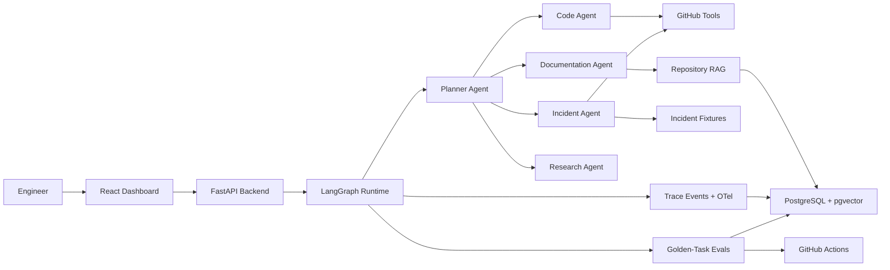

# AgentOps Interview Prep

Use this document to turn the project into interview-ready narratives. The goal is to explain not just what was built, but why the design choices are credible for production AI systems.

## 30-Second Pitch

AgentOps is a production-grade Engineering Copilot with built-in agent reliability. It helps engineers understand repositories, review pull requests, generate onboarding documentation, investigate incidents, and validate agent behavior through golden-task evaluation, tracing, regression reports, and GitHub Actions quality gates.

Unlike a generic chatbot, AgentOps combines user-facing engineering workflows with the reliability infrastructure mature AI teams need before deploying agents into real development processes.

## Architecture Overview



Core explanation:

- FastAPI exposes workflow, repository, eval, and trace APIs.
- LangGraph coordinates the Planner and specialized agents.
- GitHub tools provide read-only repository and PR context.
- Repository RAG provides source-grounded explanations.
- Trace events and OpenTelemetry make agent behavior observable.
- Golden-task evals and regression reports verify reliability.
- GitHub Actions turns evals into AI quality gates.

## Key Design Decisions

### Why LangGraph?

LangGraph was chosen because the project needs explicit state, task decomposition, specialized agent routing, and traceable workflow execution. It is a better fit than a simple chat loop because the demos require multi-step investigations, not one-shot responses.

Tradeoff:

- More structure and learning curve than a simple agent framework.
- Better production story for planning, branching, and reliability.

### Why FastAPI?

FastAPI keeps the backend in Python, close to LangGraph, embedding providers, eval code, and telemetry libraries. It also supports clean API boundaries and typed request/response models without slowing down the solo build.

Tradeoff:

- Less enterprise Java signal than Spring Boot.
- Faster for AI platform prototyping and easier to integrate with Python agent tooling.

### Why PostgreSQL + pgvector?

PostgreSQL + pgvector keeps app data, traces, evals, and embeddings in one local database. This reduces operational complexity and supports a credible backend architecture without adding a separate vector database in MVP.

Tradeoff:

- Less specialized than Pinecone or Qdrant.
- Simpler local development and better MVP completion odds.

### Why Modular Monolith?

The MVP uses a modular monolith because the goal is a working 4-6 week demo, not distributed-systems complexity. Modules stay clean enough to split later, but one backend is easier to build, test, and demo.

Tradeoff:

- Less microservice scale story in MVP.
- Much higher chance of finishing all six demos.

### Why GitHub-Only Tools In MVP?

GitHub supports repository understanding, PR review, and code-change investigation, which are central to the project identity. Adding Jira, Confluence, Slack, or PagerDuty before the six demos work would dilute focus.

Tradeoff:

- Incident investigation uses fixtures at first.
- The core Engineering Copilot story still works.

### Why Golden-Task Evaluation?

Golden tasks are easy to explain and map directly to the six demos. They support deterministic checks for required facts, expected tools, and regressions before introducing more complex eval frameworks.

Tradeoff:

- Less broad than benchmark suites.
- More practical for project completion and CI gating.

### Why OpenTelemetry?

OpenTelemetry gives the project a production-grade observability story. It also makes agent behavior easier to explain in interviews: planner spans, tool spans, model spans, retrieval spans, and eval spans.

Tradeoff:

- Adds setup complexity.
- Worth it because observability is one of the key differentiators.

## Expected Interview Questions

### What problem does AgentOps solve?

AgentOps solves two connected problems: engineering teams need useful AI copilots for repository and incident workflows, and they need reliability tools to evaluate, trace, and prevent regressions in agent behavior.

### How does the planner work?

The planner classifies the user request into a workflow type, creates a short task plan, assigns tasks to specialized agents, and records the plan in the trace. Each agent returns findings that the final synthesizer turns into an engineering answer.

### How do you prevent generic answers?

The system requires source attribution from GitHub tools and repository RAG. Answers should include important files, PR references, tool evidence, and uncertainty markers when claims are inferred.

### How does the PR review workflow identify risks?

It fetches PR metadata and changed files, summarizes affected components, compares changes against repository context, and evaluates risks across correctness, reliability, performance, security, and test coverage.

### How does the incident investigation workflow work without real production systems?

MVP uses realistic fixtures: sample logs, deployment events, and PR/code changes. This keeps the demo reliable while proving the investigation workflow. Phase 2 can connect real observability tools.

### How does evaluation work?

Golden tasks define prompts, required facts, expected tools, and scoring rules. The eval runner executes tasks against an agent version, stores results, and compares versions to detect regressions.

### How would you scale this?

First, keep the modular monolith until real bottlenecks appear. Then split expensive ingestion/eval work into workers, add queue-backed execution, optimize pgvector indexes or move retrieval to a dedicated vector DB, and export OpenTelemetry traces to a production backend.

### What are the biggest tradeoffs?

The biggest tradeoff is choosing MVP completion over enterprise completeness. GitHub-only tools, fixture-based incidents, simple policies, and golden-task evals are intentional choices to ship a strong portfolio demo in 4-6 weeks.

### What would Phase 2 include?

Phase 2 adds Jira, Confluence, real log/metrics integrations, richer policy configuration, RBAC, human feedback, advanced dashboards, and multi-model routing after the core demos are stable.

## System Design Discussion Points

Use these when an interviewer asks for deeper design.

### Reliability

- Agent runs are traceable through structured events.
- Tool calls are logged with inputs, output summaries, latency, and status.
- Eval suites create repeatable regression checks.
- Policy rules limit tool calls, runtime, and unsafe behavior.

### Observability

- OpenTelemetry spans represent planner, agent, retrieval, model, tool, and eval work.
- Stored trace events power the dashboard.
- Cost and latency metrics are tracked per run and per eval.

### Data Model

- Repositories, chunks, runs, traces, tools, evals, and policies are separate tables.
- pgvector stores embeddings close to repository metadata.
- Eval runs can be compared by version label.

### Security

- MVP uses read-only GitHub tools.
- Tool payloads and traces should redact secrets.
- Phase 2 can add RBAC, workspace boundaries, and audit retention.

### CI/CD

- GitHub Actions runs tests and evals.
- Regression reports can block PRs if pass rate drops.
- This mirrors how production teams would gate prompt/model changes.

## Resume Talking Points

Potential bullets:

- Built a production-grade multi-agent Engineering Copilot using LangGraph and FastAPI for repository analysis, PR review, onboarding documentation, and incident investigation.
- Implemented GitHub-integrated tool calling and repository RAG with PostgreSQL + pgvector to generate source-grounded engineering answers.
- Developed a golden-task evaluation framework with regression comparison to detect agent behavior changes across versions.
- Added OpenTelemetry-based tracing for planner steps, tool invocations, retrieval, model calls, latency, and cost.
- Automated AI quality gates through GitHub Actions to surface pass-rate, latency, cost, and regression reports during pull requests.

## Demo Script

### Demo 1: Explain Repository Architecture

Prompt:

```text
Explain this repository architecture.
```

Show:

- Planner steps.
- GitHub file reads.
- RAG retrieval.
- Architecture answer with source references.

### Demo 2: Review A PR

Prompt:

```text
Review PR #145 and identify risks.
```

Show:

- PR metadata and changed files.
- Risk findings.
- Missing tests.
- Merge recommendation.

### Demo 3: Generate Onboarding Docs

Prompt:

```text
Generate onboarding documentation for this service.
```

Show:

- Retrieved docs/source context.
- Generated Markdown doc.
- Source attribution.

### Demo 4: Investigate Incident

Prompt:

```text
Investigate checkout latency spike after yesterday's deployment.
```

Show:

- Investigation plan.
- Logs and recent PR evidence.
- RCA with mitigation.

### Demo 5: Run Evaluation Suite

Prompt:

```text
Run the MVP evaluation suite.
```

Show:

- Golden tasks.
- Scores.
- Tool-use checks.
- Pass/fail summary.

### Demo 6: Compare Versions

Prompt:

```text
Compare eval run A and eval run B.
```

Show:

- Pass-rate change.
- Regressed tasks.
- Cost/latency changes.
- CI-style recommendation.

## Tradeoff Narratives

### Why not build enterprise features first?

Because the project is meant to demonstrate a working Engineering Copilot. Enterprise features like RBAC, multi-tenancy, billing, and audit retention do not help the first six demos and would increase the risk of never reaching a compelling demo.

### Why not integrate every engineering tool?

GitHub is enough to demonstrate repository intelligence, PR review, and code-change investigation. Additional tools can be added once the core agent workflows are reliable.

### Why not build a full eval platform first?

The eval platform exists to support the copilot. Golden tasks tied to real demos provide stronger portfolio value than a generic eval engine with no compelling agent workflow.

## Scaling Strategy

After MVP:

1. Move long-running ingestion and evals to background workers.
2. Add queue-backed execution for concurrent agent runs.
3. Export OpenTelemetry traces to a production backend.
4. Add dedicated vector storage if pgvector becomes limiting.
5. Introduce workspace and RBAC only when multiple users exist.
6. Add Jira, Confluence, and observability integrations.
7. Add human feedback and continuous eval dataset expansion.

## Future Enhancements

- Jira ticket triage.
- Confluence documentation search.
- Real log and metrics connectors.
- PR comment bot.
- Human feedback loop.
- Agent scorecards.
- Prompt/version registry.
- Advanced policy configuration.
- Multi-model comparisons.
- Production deployment guide.

## Interview Red Flags To Avoid

- Do not describe AgentOps as just a chatbot.
- Do not lead with database schema before product workflows.
- Do not claim enterprise readiness in MVP.
- Do not overstate autonomous production incident handling.
- Do not hide fixture usage in the incident demo.
- Do not discuss evals as perfect correctness guarantees.

## Strong Closing Summary

AgentOps demonstrates the full loop of production AI engineering:

```text
Build useful agent workflows
Trace what the agent did
Evaluate whether it worked
Detect regressions before shipping
```

That loop is the core reason the project is stronger than a generic RAG app or chatbot.
